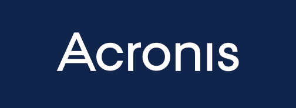

Last but not least we would like to thank our Silver Sponsors. Four of them
have been sponsoring us in recent years already and we are very happy to have
them back. With their combined contribution we will be able to record all
talks and upload them on Youtube for the broader Python community to see.

  

Solace Tech Pte. Ltd. is an IT training company aspiring to help
people to learn technology by simple premises: pre-course work before
the class, and blended learning. We blend classroom and self-paced
learning sessions to maximize hands-on ability, time flexibility, and
affordability. Try our Python class with a guarantee: if you are still
not able to create a simple program, we will give you a free seat to
join the next class.

Jublia is proud to do their small part within the community to sponsor
PYCON APAC 2018. Python is the one to rule them all at Jublia.
It is utilised throughout their entire organisation and systems
to deliver a stable, secure and high performance enterprise grade
platform.

Jublia is an established global leader in business matching technology
and event data analytics.

Their mission is to empower event organisers to intelligently match
people and content at their events. At Jublia, they believe in enabling
people to discover useful content and meet relevant others through
intelligent matching technologies. Simultaneously, they empower
organisers with analytics to easily prove that their events are the
undisputed channel for marketing spend by businesses in terms of ROI.

Acronis is a Swiss-Singaporean company that sets the standard for
hybrid cloud data protection through its backup, disaster recovery,
and secure file sync and share solutions.

Founded in 2003, Acronis protects the data of over 5 million consumers
and 500,000 businesses in over 145 countries. With more than 100
patents, Acronis products have been named best product of the year,
and cover a range of features, including migration, cloning and
replication. Today, Acronis solutions are available worldwide through
a global network of service providers, distributors and cloud
resellers.

The team at The Artling is passionate about art and feels that there is a
great deal of undiscovered talent in Asia. They work with some of the
top galleries and artists in the region and feature their work online
in order to make their work accessible to the international market. They
are in essence an online art gallery that features a curated
collection of artworks, by a select group of emerging artists
alongside artists who are much more established and exposed in the
market.

The Artling is a proud supporter of the Python community and has been
using Python since inception. They will continue to do so as they grow and
aim to disrupt the art discovery and acquisition process, whilst also
contributing to the cultural landscape in Asia and beyond.

Bitlab Studio (formerly known as Bitmazk) is a Singapore based full
stack web agency specialized on creating web applications and mobile
apps built with Python, Django, ReactJS and ReactNative.

Since we have sponsored PyCon Sigapore in 2016, our team has grown and
our focus has shifted more towards mobile apps with ReactNative, while
Django and GraphQL remain our bread and butter on the backend side of
things. We are always looking for talented full stack developers in
the region.

Solacetech and Acronis will have a booth at the conference, so
don't miss your chance to get to know them in person when you attend the
conference!
